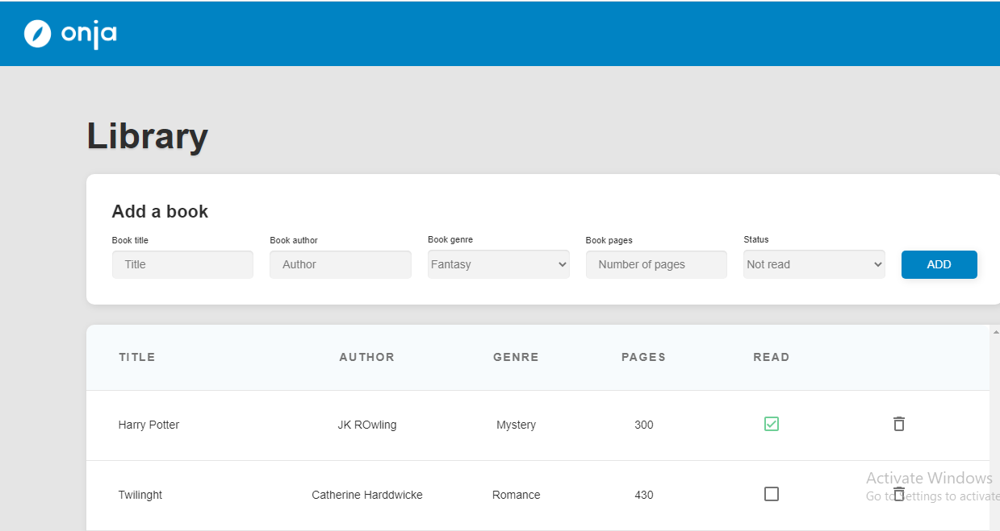

# bookList

With this project, I use vanilla Js. The users can add news list of book, can mark as read and delete it if they want to.

This is the link of it:

[deploy netlify](https://book-lists-petah.netlify.app/)